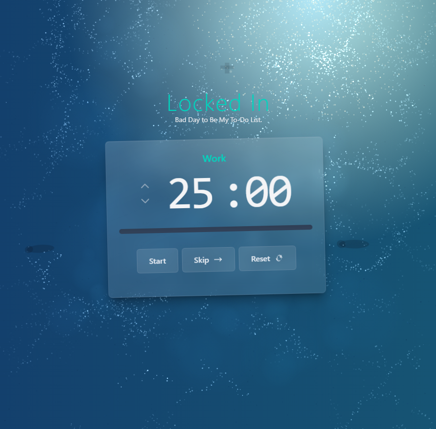

# Locked-In: A Focused Pomodoro Timer with Dynamic Backgrounds

**[Live Demo](https://goatcheese98.github.io/Locked-In/)** 



Locked-In is a visually engaging Pomodoro timer application built with SvelteKit. It helps you manage work and break sessions effectively using the Pomodoro Technique, while providing a relaxing, customizable background.

## What is the Pomodoro Technique?

The Pomodoro Technique is a time management method that uses a timer to break work into intervals, typically 25 minutes in length, separated by short breaks. This app helps you implement that technique easily.

## Features ✨

*   **Classic Pomodoro Workflow:** Easily switch between Work, Short Break, and Long Break sessions.
*   **Customizable Timer:** Adjust the duration (in minutes) for:
    *   Work sessions
    *   Short breaks
    *   Long breaks
*   **Session Management:** Configure how many work sessions occur before a longer break is triggered.
*   **Dynamic Gradient Background:** Enjoy a beautiful, subtly shifting background gradient.
    *   **HSL Color Controls:** Use sliders to precisely control the Hue, Saturation, and Lightness for both gradient color stops. A preview box shows the current color and HSL values.
    *   **Color History:** Easily cycle back and forth through your recent color choices for each gradient stop using the arrow buttons.
    *   **Randomize:** Get inspired with randomly generated colors using the sparkle button. ✨
    *   **Controlled Auto-Cycle:** Toggle an option for each color to automatically and slowly drift towards new random HSL values over time, keeping the background fresh without being distracting.
*   **Subtle Floating Effect:** A gentle animation makes the main timer panel appear to "float" (can be toggled on/off).
*   **Unified Settings Panel:** Access all timer and background customization options conveniently in one slide-out panel.
*   **Persistent Settings:** Your preferences for timer durations and background colors are automatically saved in your browser's local storage, so they'll be there when you return.
*   **Modern Tech:** Built with SvelteKit and the latest Svelte 5 features (Runes) for a reactive and efficient experience.

## How to Use 🤔

1.  **Start the Timer:** Click the "Start" button to begin a work session.
2.  **Focus:** Work until the timer rings.
3.  **Take a Break:** The timer will automatically suggest the appropriate break (short or long). Click "Start" to begin the break timer.
4.  **Customize (Optional):**
    *   Click the **Settings** (gear) icon in the top right.
    *   Adjust **Timer Settings** like work/break durations.
    *   Explore **Background Effects**:
        *   Use the HSL sliders or history buttons to change the gradient colors.
        *   Try the "Randomize" button.
        *   Enable "Auto-Cycle" for one or both colors.
        *   Toggle the "Enable floating effect?".
        *   Click "Reset to Defaults" to restore the original background settings.
5.  **Repeat:** Continue the work/break cycles!

## Getting Started (for Developers) 🧑‍💻

Want to run or modify this project locally?

**Prerequisites:**

*   **Node.js:** Make sure you have Node.js installed. You can download it from [nodejs.org](https://nodejs.org/). npm (Node Package Manager) is included with Node.js.

**Setup:**

1.  **Clone the repository:**
    ```bash
    git clone https://github.com/goatcheese98/Locked-In.git
    cd Locked-In
    ```

2.  **Install dependencies:** This command downloads all the necessary libraries the project needs.
    ```bash
    npm install 
    # Or if you prefer pnpm or yarn:
    # pnpm install
    # yarn
    ```

3.  **Run the development server:** This starts a local web server so you can see the app in action.
    ```bash
    npm run dev
    ```
    *Optional: To automatically open the app in your browser:*
    ```bash
    npm run dev -- --open
    ```
    Navigate to `http://localhost:5173` (or the address shown in your terminal). The app will automatically reload if you make changes to the code.

## Building for Production 🚀

To create an optimized version of the app for deployment:

```bash
npm run build
```

This will create static files in the `docs/` directory, configured for deployment to GitHub Pages.

You can preview the production build locally *before* deploying:

```bash
npm run preview
```

## Deployment 🌐

This repository is automatically deployed to GitHub Pages using GitHub Actions whenever changes are pushed to the `master` branch.

The live site is available at: **[https://goatcheese98.github.io/Locked-In/](https://goatcheese98.github.io/Locked-In/)**

## Contributing 🤝

Contributions, issues, and feature requests are welcome! Feel free to check the [issues page](https://github.com/goatcheese98/Locked-In/issues) if you want to contribute.


